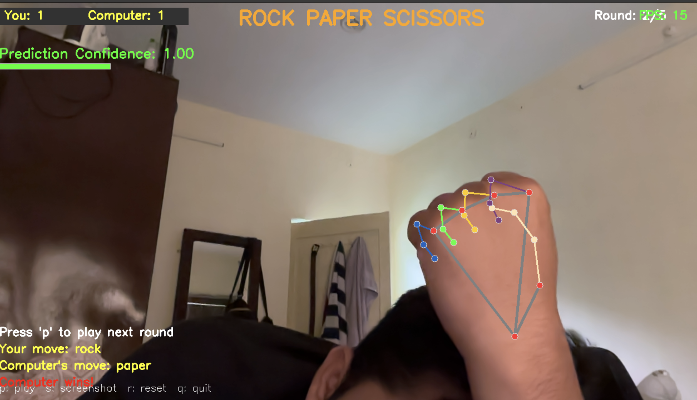

# Real-Time Rock Paper Scissors AI Game

[](https://www.python.org/)
[](https://opensource.org/licenses/MIT)

**[➡️ Live Demo on Streamlit Cloud](https://rock-paper-scisor-ai-game-dkvpjux3c2uffse8zyxdyh.streamlit.app/)**

Play Rock Paper Scissors against an AI using your webcam! This project demonstrates an end-to-end machine learning pipeline for real-time hand gesture recognition, built with Python, OpenCV, MediaPipe, and Scikit-learn.


*Live gameplay showing MediaPipe hand tracking and the prediction UI.*

## Project Goal

The primary goal was to build a hands-on project showcasing skills relevant to ML Engineering, including:
*   Developing a complete ML workflow: Data collection -> Preprocessing -> Training -> Evaluation -> Deployment (in a real-time application).
*   Integrating computer vision models (MediaPipe) with traditional ML classifiers (Scikit-learn).
*   Building an interactive application using OpenCV.
*   Managing dependencies and project structure.

## Key Features & Technical Highlights

*   **Custom Data Collection Pipeline (`data_collection.py`):**
    *   Interactive UI using OpenCV for capturing training images (Rock, Paper, Scissors).
    *   Automated hand detection (MediaPipe) to ensure only valid hand images are saved.
    *   Saves both full frames and automatically cropped hand regions for flexible training options.
*   **Robust Model Training Pipeline (`model_training.py`):**
    *   Loads and preprocesses images, currently using pixel data from cropped hands.
    *   Implements data augmentation (flips, rotations, brightness/contrast shifts) to improve model generalization.
    *   Supports training and evaluation of multiple classifiers (KNN, SVM, RandomForest) via Scikit-learn pipelines.
    *   Includes dimensionality reduction (PCA) for potentially faster training.
    *   Performs basic hyperparameter tuning (GridSearch).
    *   Provides detailed evaluation metrics (accuracy, confusion matrix, classification report).
    *   Serializes the best-performing model using `joblib` for easy loading in the game.
*   **Real-Time Game Application (`game.py`):**
    *   Captures webcam feed via OpenCV.
    *   Utilizes MediaPipe for efficient real-time hand detection and landmark tracking.
    *   Loads the trained Scikit-learn model to predict the user's gesture.
    *   Implements game logic (countdown, rounds, scoring).
    *   Provides clear UI feedback: draws landmarks, shows scores, prediction confidence, game state messages, and results.
    *   Includes keyboard fallback controls for accessibility and testing.
    *   Calculates and displays FPS for performance monitoring.
*   **Modular Code (`utils.py`):** Helper functions for hand detection, image processing, drawing UI elements, etc., are organized into a separate utility module.

## Project Structure

```
rock_paper_scissors/
├── data/                  # Training images (needs to be populated via data_collection.py)
│   ├── rock/
│   ├── paper/
│   └── scissors/
├── models/                # Saved ML models (generated by model_training.py)
├── screenshots/           # Contains example screenshots like live_gameplay.png
├── .venv/ or env/         # Python virtual environment (Created by user)
├── .git/                  # Git repository data
├── .gitignore             # Specifies intentionally untracked files for Git
├── data_collection.py     # Script to collect training images
├── model_training.py      # Script to train the ML model
├── game.py                # Main script to run the interactive game
├── utils.py               # Helper functions for vision, ML, and UI tasks
├── requirements.txt       # Lists Python dependencies for pip
└── README.md              # This file!
```

## Installation

Make sure you have Python 3.9 or newer installed.

1.  **Clone the repository:**
    ```bash
    git clone https://github.com/yourusername/Rock-Paper-Scissor.git # Replace with your repo URL
    cd Rock-Paper-Scissor
    ```

2.  **Create and activate a virtual environment:**
    *   On macOS/Linux:
        ```bash
        python3 -m venv .venv
        source .venv/bin/activate
        ```
    *   On Windows:
        ```bash
        python -m venv .venv
        .\.venv\Scripts\activate
        ```

3.  **Install dependencies:**
    ```bash
    pip install -r requirements.txt
    ```

## Usage Guide

Follow these steps to run the project:

### 1. Collect Training Data

*   **Run the script:**
    ```bash
    python data_collection.py
    # Or if your venv python isn't default: .venv/bin/python data_collection.py
    ```
*   **Follow the on-screen prompts:** The script will guide you to capture images for 'rock', 'paper', and 'scissors' gestures. Hold the gesture steady in the frame. Press 'c' to capture automatically when a hand is detected, or 'm' for manual capture.
*   **Goal:** Collect at least 50-100 diverse images per gesture (different angles, lighting, distances). More data generally leads to a better model. Data is saved in the `data/` directory.

### 2. Train the Model

*   **Run the script:**
    ```bash
    python model_training.py
    # Or: .venv/bin/python model_training.py
    ```
*   **Process:** This script loads the collected data, preprocesses it, applies augmentation, trains different ML models, evaluates them, and saves the best one (e.g., `rps_model_latest.pkl`) to the `models/` directory.

### 3. Play the Game!

*   **Run the script:**
    ```bash
    python game.py
    # Or: .venv/bin/python game.py
    ```
*   **Gameplay:**
    *   The game window will appear, using your webcam feed.
    *   Follow the on-screen prompts (Welcome -> Countdown -> Play).
    *   During the 'Play' phase (after the countdown), show your hand gesture clearly to the camera.
    *   The game will predict your move, determine the winner against the computer's random choice, and display the result.
    *   Press 'p' to play the next round.
*   **Controls:**
    *   `p`: Start game / Play next round
    *   `s`: Save a screenshot to the `screenshots/` folder
    *   `r`: Reset the game score and rounds
    *   `q`: Quit the game
    *   `1`, `2`, `3`: Keyboard fallback to input Rock, Paper, or Scissors during the 'Play' state if hand detection struggles.

## Challenges & Future Work

*   **Model Accuracy:** The current model uses raw pixel data from cropped hands. While functional, its accuracy can be sensitive to lighting changes, background clutter, and hand orientation. Sometimes, similar gestures (like 'scissors' and 'rock' from certain angles) might be confused.
*   **Improving Robustness (Future Work):**
    *   **Landmark Features:** A significant improvement would be to retrain the model using normalized *landmark coordinates* from MediaPipe instead of pixel data. This approach is generally more robust to variations in scale, rotation, and lighting. This would involve modifying both `model_training.py` (feature extraction) and `game.py` (prediction input).
    *   **More Data:** Continuously adding more diverse training data via `data_collection.py` will help the existing model improve.
    *   **Advanced Models:** Experimenting with Convolutional Neural Networks (CNNs) could potentially yield higher accuracy, especially if trained on larger datasets.
*   **Deployment:** Explore options for deploying the game, perhaps as a web application using Flask/Django and WebRTC, or packaging it as a desktop executable. Platforms like Hugging Face Spaces or Streamlit could also be investigated for sharing interactive demos.

## License

This project is licensed under the MIT License - see the LICENSE file for details (if you add one).

## Acknowledgments

*   **Google MediaPipe:** For the excellent and efficient Hands solution.
*   **OpenCV:** For the core computer vision functionalities and UI display.
*   **Scikit-learn:** For the accessible machine learning library.
